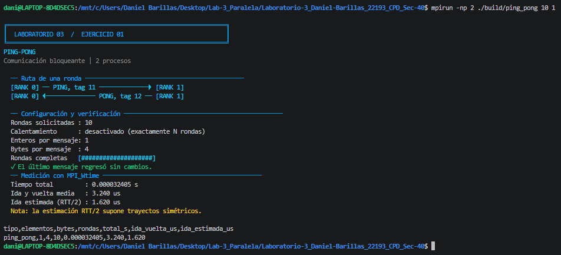
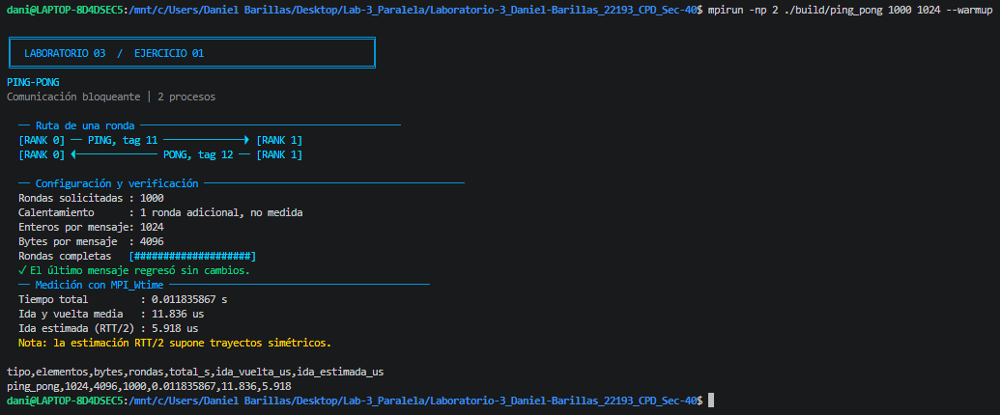
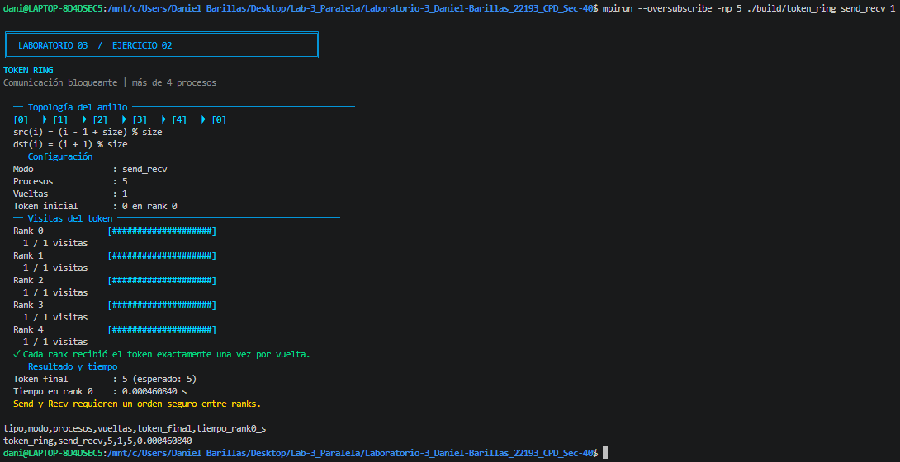
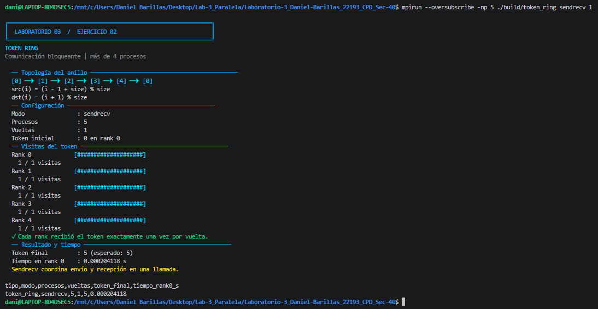
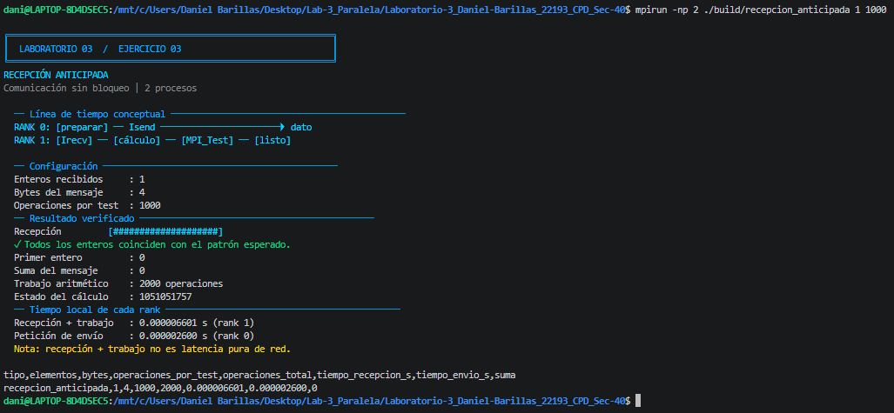
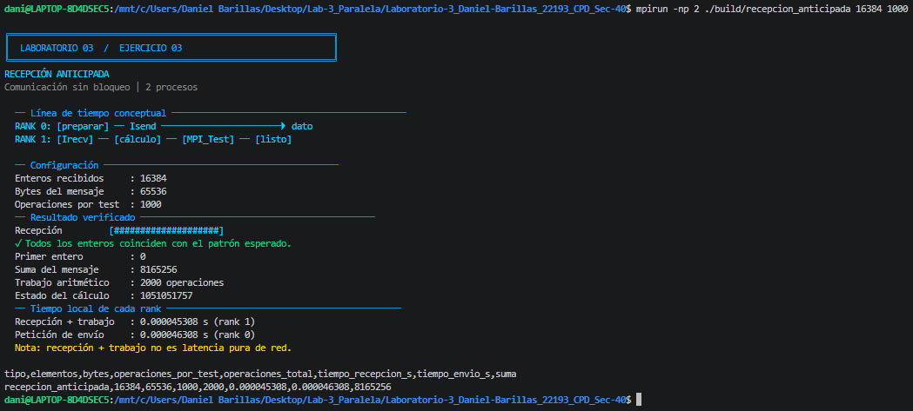
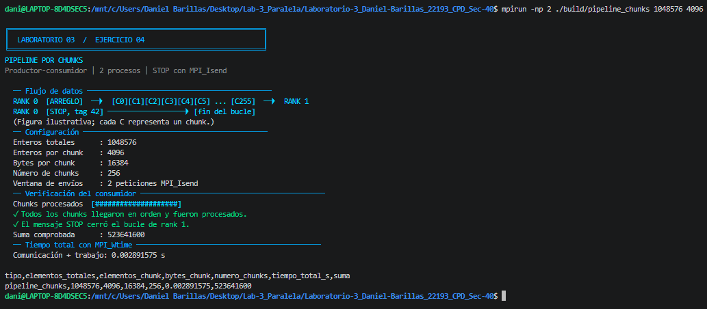
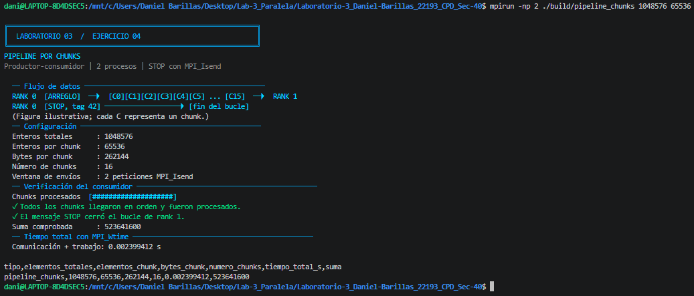

<div align="center">

# Laboratorio 3 · Comunicación con MPI

### Computación Paralela y Distribuida · Universidad del Valle de Guatemala

Daniel Barillas · Carné 22193 · Sección 40

`C11` · `Open MPI` · `Ubuntu / WSL` · `4 ejercicios` · `51 mediciones`

[Ejecución](#compilación-y-ejecución) · [Resultados](#resultados-experimentales) · [Evidencias](#evidencias-de-ejecución) · [PDF](informe/informe.pdf)

</div>

---

Cuatro implementaciones de comunicación entre procesos: intercambio de ida y
vuelta, circulación de un token, recepción anticipada con trabajo aritmético y
pipeline productor–consumidor. Cada programa valida los datos, presenta diagramas
y comprobaciones en terminal, y termina con una fila CSV sin códigos de color.

| Ejercicio | Modelo | Procesos | Operaciones principales |
|:---|:---|:---:|:---|
| **01 · Ping-Pong** | Ida y vuelta bloqueante | 2 | `MPI_Send`, `MPI_Recv` |
| **02 · Token Ring** | Anillo con un único token | ≥ 5 | `MPI_Send` / `MPI_Recv`, `MPI_Sendrecv` |
| **03 · Recepción anticipada** | Comunicación y cálculo local | 2 | `MPI_Irecv`, `MPI_Isend`, `MPI_Test` |
| **04 · Pipeline** | Productor–consumidor por chunks | 2 | `MPI_Isend`, `MPI_Wait`, `MPI_Probe`, `MPI_Recv` |

## Compilación y ejecución

### Entorno y compilación

Desde Ubuntu en WSL, con el repositorio como directorio de trabajo:

```bash
sudo apt update
sudo apt install build-essential openmpi-bin libopenmpi-dev python3

cd "/mnt/c/Users/Daniel Barillas/Desktop/Lab-3_Paralela/Laboratorio-3_Daniel-Barillas_22193_CPD_Sec-40"
make
```

El `Makefile` utiliza `mpicc` con `-std=c11 -O2 -Wall -Wextra -Wpedantic` y
genera los cuatro ejecutables en `build/`. Python 3 se utiliza únicamente para
resumir los resultados; no es necesario para ejecutar los programas MPI.

### 01 · Ping-Pong

```bash
# Sintaxis: ping_pong <rondas_N> <enteros_por_mensaje> [--warmup]
mpirun -np 2 ./build/ping_pong 10 1
mpirun -np 2 ./build/ping_pong 1000 1024

# Una ronda preparatoria adicional para reproducir el protocolo del barrido
mpirun -np 2 ./build/ping_pong 1000 1024 --warmup
```

Rank 0 envía el mensaje y espera su devolución; rank 1 recibe y devuelve el
mismo contenido. Por defecto realiza **exactamente N rondas**, sin intercambios
adicionales. `--warmup` añade una ronda preparatoria fuera del cronómetro;
las N rondas restantes son las medidas. La salida identifica esta opción e
informa tiempo total, RTT medio por ronda y estimación de ida `RTT/2`.

### 02 · Token Ring

```bash
# Sintaxis: token_ring <send_recv|sendrecv> <vueltas>
mpirun --oversubscribe -np 5 ./build/token_ring send_recv 1
mpirun --oversubscribe -np 5 ./build/token_ring sendrecv 1

# Configuración del experimento de rendimiento
mpirun --oversubscribe -np 5 ./build/token_ring send_recv 1000
mpirun --oversubscribe -np 5 ./build/token_ring sendrecv 1000
```

Cada rank recibe de `(rank - 1 + size) % size` y envía a `(rank + 1) % size`.
El token comienza en cero; al finalizar debe valer `procesos × vueltas`.
`--oversubscribe` permite lanzar cinco procesos aunque Open MPI informe menos
slots disponibles; no implica que los cinco procesos dispongan de núcleos dedicados.

### 03 · Recepción anticipada

```bash
# Sintaxis: recepcion_anticipada <enteros> <operaciones_por_test>
mpirun -np 2 ./build/recepcion_anticipada 1 1000
mpirun -np 2 ./build/recepcion_anticipada 16384 1000
```

Rank 1 publica `MPI_Irecv`, ejecuta un lote de aritmética y consulta `MPI_Test`.
Repite cálculo y consulta hasta completar la recepción. Rank 0 envía con
`MPI_Isend` y completa su petición con `MPI_Wait`. La salida incluye contenido
verificado, suma, cantidad de iteraciones aritméticas, estado del cálculo y
duraciones locales de ambos ranks.

### 04 · Pipeline por chunks

```bash
# Sintaxis: pipeline_chunks <enteros_totales> <enteros_por_chunk>
mpirun -np 2 ./build/pipeline_chunks 1048576 4096
mpirun -np 2 ./build/pipeline_chunks 1048576 65536
```

Rank 0 divide el arreglo en bloques iguales y mantiene hasta dos envíos
pendientes. Rank 1 recibe, verifica y suma cada bloque antes de recibir el
siguiente. El mensaje `STOP`, enviado con `MPI_Isend`, termina el consumo.
El tamaño del chunk debe dividir exactamente el total de enteros.

### Barrido de mediciones y análisis

```bash
# Ejecutar los cuatro experimentos con tres repeticiones por configuración
bash scripts/mediciones.sh

# Analizar los CSV ya existentes, sin ejecutar MPI ni modificar archivos
python3 scripts/analizar_resultados.py

# Regenerar las cuatro gráficas del informe (requiere Matplotlib)
python3 scripts/graficas_resultados.py
```

El barrido usa `--warmup` en Ping-Pong, conservando una ronda preparatoria y
1000 rondas medidas. Guarda tablas en `resultados/` y registros completos en
`resultados/brutos/`. Para proteger las mediciones, se detiene si ya existen los
CSV, como ocurre en este repositorio. Para obtener un nuevo conjunto, deben
archivarse previamente los cuatro CSV y sus registros brutos en otra carpeta.

El analizador comprueba configuraciones, repeticiones, tiempos positivos,
consistencia del RTT, tokens y sumas. Imprime las tablas y comparaciones de
este README. También acepta otra carpeta: `python3 scripts/analizar_resultados.py ruta/resultados`.

La salida de los programas utiliza colores ANSI y diagramas Unicode. Los
paneles se imprimen después de cerrar la medición; las barras indican
finalización, no rendimiento. Para desactivar el color:

```bash
NO_COLOR=1 mpirun -np 2 ./build/ping_pong 10 1
```

Para regenerar gráficas en WSL, Matplotlib puede instalarse en un entorno
aislado; no es necesario para analizar los CSV ni para compilar el informe
con las figuras incluidas:

```bash
sudo apt install python3-venv
python3 -m venv .venv
source .venv/bin/activate
python -m pip install matplotlib==3.10.1
python scripts/graficas_resultados.py
```

## Resultados experimentales

Los resultados proceden de los cuatro [CSV versionados](resultados/):
**51 ejecuciones, 17 configuraciones y 3 repeticiones por configuración**.
Las 51 filas coinciden con la última línea de sus registros locales originales.
No hay configuraciones faltantes ni repeticiones duplicadas.

**Trazabilidad del calentamiento:** los CSV de Ping-Pong se obtuvieron con una
ronda preparatoria fuera del cronómetro. La versión final conserva ese mismo
protocolo mediante `--warmup` y lo desactiva por defecto para cumplir
literalmente N intercambios. Las capturas actuales sí corresponden al programa
final: la primera muestra N exacto y la segunda activa `--warmup`. Sus tiempos
son demostrativos y no reemplazan ni reescriben las mediciones del barrido.

Se presenta la **mediana** como resumen principal, acompañada por la media,
la desviación estándar muestral (**DE**, divisor `n − 1`) y el intervalo
observado mínimo–máximo. No se excluyó ninguna medición. Las tablas redondean
a tres decimales; los cocientes se calculan antes de ese redondeo. Los valores
de RTT del CSV ya tienen tres decimales de precisión.

> Las tres repeticiones describen estas ejecuciones locales en WSL, no una
> población de equipos. No se realizaron pruebas de significancia ni se afirma
> una mejora universal. Las capturas documentan ejecuciones demostrativas
> independientes: sus tiempos no sustituyen los del barrido experimental.

### Resumen de hallazgos

| Experimento | Resultado observado | Alcance |
|:---|:---|:---|
| Ping-Pong | RTT mediano de **0.495 a 50.171 µs** | Mensajes de 4 a 262 144 bytes; 1000 rondas por ejecución |
| Token Ring | **2.242 ms** con `send_recv`; **3.290 ms** con `sendrecv` | Cinco procesos y 1000 vueltas; distinto tráfico entre implementaciones |
| Recepción anticipada | Recepción + cálculo de **6.701 a 121.223 µs** | Lotes de 1000 iteraciones; trabajo total variable |
| Pipeline | **2.279 ms** con chunks de 65 536 enteros | Menor mediana entre los cinco tamaños ensayados; 4 MiB totales |

### 01 · Ping-Pong: tamaño del mensaje y RTT

Datos: [ping_pong.csv](resultados/ping_pong.csv). Dos procesos y **1000 rondas**
en las tres repeticiones de cada tamaño. `RTT = tiempo_total × 10⁶ / rondas`.

| Enteros por mensaje | Bytes | RTT mediano (µs) | Media ± DE (µs) | Mín.–máx. (µs) |
|---:|---:|---:|---:|---:|
| 1 | 4 | 0.495 | 0.545 ± 0.118 | 0.461–0.680 |
| 64 | 256 | 0.578 | 0.579 ± 0.013 | 0.566–0.592 |
| 1024 | 4096 | 3.625 | 3.824 ± 0.489 | 3.467–4.381 |
| 16384 | 65536 | 13.846 | 13.717 ± 0.316 | 13.357–13.947 |
| 65536 | 262144 | 50.171 | 49.659 ± 2.756 | 46.683–52.124 |

El RTT mediano crece en los cinco tamaños ensayados. Entre 4 y 256 bytes cambia
de 0.495 a 0.578 µs, mientras que a 262 144 bytes alcanza 50.171 µs: **101.36
veces** el valor del caso mínimo, aunque el mensaje contiene 65 536 veces más
datos. Esto es compatible con un costo fijo por intercambio y un costo
dependiente del tamaño; el experimento no separa ambos componentes ni identifica
umbrales de protocolos internos de Open MPI.

El RTT mide ida **y** vuelta. Dividirlo entre dos aproxima una dirección solo
bajo el supuesto de trayectos simétricos; no constituye una medida independiente
de latencia unidireccional. Las 1000 rondas producen un promedio dentro de cada
ejecución, no 1000 muestras estadísticas independientes.

La comprobación posterior verifica que el último mensaje conserva el patrón
`valor[i] = i % 1009`.

### 02 · Token Ring: llamadas separadas frente a Sendrecv

Datos: [token_ring.csv](resultados/token_ring.csv). **Cinco procesos, 1000
vueltas y token final 5000** en las seis ejecuciones. El cronómetro de rank 0
incluye la barrera de finalización, pero no la recopilación posterior de visitas.

| Variante | Mediana (ms) | Media ± DE (ms) | Mín.–máx. (ms) | Token final |
|:---|---:|---:|---:|---:|
| `send_recv` | 2.242 | 2.245 ± 0.122 | 2.125–2.369 | 5000 |
| `sendrecv` | 3.290 | 3.314 ± 0.211 | 3.116–3.535 | 5000 |

En estas corridas, `sendrecv` tarda **1.467 veces** el tiempo mediano de
`send_recv`, equivalente a un **46.71 % más**. La diferencia no puede atribuirse
únicamente a la función MPI: las implementaciones generan tráfico distinto.

`send_recv` transfiere el token por cinco enlaces en cada vuelta: **5000
mensajes** en 1000 vueltas. `sendrecv` realiza cinco pasos por vuelta; en cada
paso los cinco ranks envían un valor, sea el token o el centinela `-1`: **25 000
mensajes**. Estas cuentas excluyen barreras y la recopilación final. Por tanto,
no se trata de una comparación aislada del costo de dos primitivas equivalentes.

La ventaja funcional de `MPI_Sendrecv` es combinar un envío y una recepción en
una llamada bloqueante y resolver las dependencias del desplazamiento. Las
llamadas separadas requieren un orden seguro: rank 0 inicia enviando y los
otros ranks reciben antes de reenviar. Esa propiedad no garantiza que
`MPI_Sendrecv` sea más rápido. Véase la [documentación oficial de MPI_Sendrecv](https://docs.open-mpi.org/en/main/man-openmpi/man3/MPI_Sendrecv.3.html).

Ambas variantes verifican `token_final = procesos × vueltas` y exactamente
1000 visitas por rank en el barrido; las capturas muestran el caso de una vuelta.

### 03 · Recepción anticipada: comunicación con trabajo local

Datos: [recepcion_anticipada.csv](resultados/recepcion_anticipada.csv). Dos
procesos y lotes de **1000 iteraciones aritméticas por consulta** a `MPI_Test`.
El intervalo de rank 1 incluye `MPI_Irecv`, cálculo y sondeos; excluye la
verificación posterior de los datos y la impresión.

| Enteros | Bytes | Recepción mediana (µs) | Media ± DE (µs) | Mín.–máx. (µs) | Envío mediano (µs) |
|---:|---:|---:|---:|---:|---:|
| 1 | 4 | 6.701 | 6.935 ± 0.680 | 6.402–7.701 | 2.801 |
| 64 | 256 | 7.001 | 7.601 ± 1.683 | 6.301–9.502 | 3.601 |
| 1024 | 4096 | 19.804 | 21.171 ± 2.543 | 19.604–24.105 | 18.703 |
| 16384 | 65536 | 48.710 | 49.442 ± 2.289 | 47.609–52.008 | 47.409 |
| 65536 | 262144 | 121.223 | 124.056 ± 19.213 | 106.417–144.528 | 118.823 |

| Enteros | Iteraciones aritméticas mín.–máx. | Suma verificada en las tres repeticiones |
|---:|---:|---:|
| 1 | 1000–2000 | 0 |
| 64 | 1000–1000 | 2016 |
| 1024 | 2000–3000 | 508641 |
| 16384 | 2000–3000 | 8165256 |
| 65536 | 1000–5000 | 33006624 |

La duración mediana del receptor crece de 6.701 a 121.223 µs, un factor de
**18.09** entre los extremos. No representa latencia pura: el receptor completa
al menos un lote de trabajo antes de consultar el estado de la recepción.
El contador de «operaciones» registra iteraciones del bucle aritmético, no FLOP
ni instrucciones de procesador medidas.

El lote es fijo, pero el trabajo **total no lo es**: a 65 536 enteros varía entre
1000 y 5000 iteraciones y no aumenta de forma monotónica con el tamaño del
mensaje. La cantidad de sondeos necesarios depende del progreso de la petición
y de la planificación de los procesos. No se debe interpretar este contador
como una medida directa del rendimiento de red.

Los tiempos de envío y recepción se miden con intervalos locales distintos;
restarlos no permite aislar el costo del cálculo. El programa demuestra que se
realiza trabajo entre publicar la recepción y confirmar su finalización con
[MPI_Test](https://docs.open-mpi.org/en/main/man-openmpi/man3/MPI_Test.3.html).
Sin una referencia bloqueante equivalente y con igual trabajo total, estas
mediciones no cuantifican una aceleración por solapamiento.

Las sumas de las 15 filas coinciden con el patrón `valor[i] = i % 1009`.

### 04 · Pipeline: efecto del tamaño de chunk

Datos: [pipeline_chunks.csv](resultados/pipeline_chunks.csv). Dos procesos,
**1 048 576 enteros = 4 194 304 bytes = 4 MiB** y una ventana de hasta dos
envíos pendientes. El tiempo total incluye transferencias, verificación y suma
en el consumidor, `STOP`, confirmación final y barrera; excluye la preparación
inicial del arreglo y la presentación en terminal.

| Enteros por chunk | Bytes por chunk | Número de chunks | Mediana (ms) | Media ± DE (ms) | Mín.–máx. (ms) |
|---:|---:|---:|---:|---:|---:|
| 256 | 1024 | 4096 | 4.691 | 4.413 ± 0.848 | 3.462–5.088 |
| 1024 | 4096 | 1024 | 3.670 | 3.667 ± 0.097 | 3.569–3.762 |
| 4096 | 16384 | 256 | 2.844 | 2.940 ± 0.333 | 2.666–3.311 |
| 16384 | 65536 | 64 | 2.769 | 3.589 ± 1.824 | 2.318–5.679 |
| 65536 | 262144 | 16 | 2.279 | 2.271 ± 0.118 | 2.149–2.385 |

El menor tiempo mediano corresponde a chunks de **65 536 enteros**, con
2.279 ms. Frente a los chunks de 256 enteros, el tiempo mediano se reduce
**51.42 %**, una relación de **2.059×** entre ambas duraciones. Es una comparación
de tamaños dentro del mismo pipeline, no una aceleración frente a una versión
secuencial. Es el mejor tamaño **entre los ensayados**, no un óptimo universal.

Al aumentar el bloque, la cantidad de mensajes de datos baja de 4096 a 16, sin
cambiar el volumen total. El resultado es compatible con una menor sobrecarga
por mensaje, aunque el experimento no separa comunicación, procesamiento y
planificación para demostrar cuál de ellos explica cada diferencia.

El caso de 16 384 enteros presenta la mayor dispersión: **2.318–5.679 ms**, con
media de 3.589 ms y mediana de 2.769 ms. Se conserva la corrida de 5.679 ms y no
se atribuye a una causa específica sin evidencia adicional. Las medianas bajan
con el tamaño, pero las medias no son monotónicas; ambas descripciones se
muestran para evitar ocultar esa variabilidad.

Las **15 sumas son 523 641 600**, coincidentes con `valor[i] = i % 1000`.
El programa valida cada elemento y el número de chunks; las capturas confirman
además la recepción de `STOP` y la terminación del consumidor.

## Evidencias de ejecución

Las ocho capturas proporcionadas por el estudiante están en
[evidencias/](evidencias/), con los nombres utilizados por el informe LaTeX.
Las dos evidencias de Ping-Pong fueron renovadas después de compilar la versión
final: una usa el modo exacto de N rondas y otra muestra el calentamiento
explícito del protocolo experimental.

<details>
<summary><strong>01 · Ping-Pong — entero y mensaje de 1024 enteros</strong></summary>





</details>

<details>
<summary><strong>02 · Token Ring — Send/Recv y Sendrecv</strong></summary>





</details>

<details>
<summary><strong>03 · Recepción anticipada — entero y mensaje de 16384 enteros</strong></summary>





</details>

<details>
<summary><strong>04 · Pipeline — chunks de 4096 y 65536 enteros</strong></summary>





</details>

## Organización del repositorio

```text
.
├── src/
│   ├── common.h                     Argumentos, memoria y errores MPI
│   ├── visual.h                     Paneles, colores y diagramas de terminal
│   ├── 01_ping_pong.c               Intercambio de ida y vuelta
│   ├── 02_token_ring.c              Dos variantes del anillo
│   ├── 03_recepcion_anticipada.c    Recepción, cálculo y consultas de estado
│   └── 04_pipeline_chunks.c         Productor–consumidor y señal STOP
├── scripts/
│   ├── mediciones.sh                Barrido de los cuatro experimentos
│   ├── analizar_resultados.py       Validación y estadísticas descriptivas
│   ├── graficas_resultados.py       Exportación de gráficas PDF y PNG
│   └── preparar_entrega.ps1         ZIP verificado, sin ejecutables
├── resultados/                     Cuatro CSV experimentales versionados
├── evidencias/                     Ocho capturas PNG originales
├── informe/                        Fuente LaTeX, PDF y figuras/
├── Makefile
├── LICENSE
└── README.md
```

`build/`, los registros locales de `resultados/brutos/` y los auxiliares de
LaTeX están excluidos de Git. El ZIP generado en `entrega/` tampoco se
versiona. Los ejecutables no forman parte de la entrega.

## Informe y referencias

Fuente: [informe.tex](informe/informe.tex). El [PDF actualizado](informe/informe.pdf)
incluye las ocho evidencias, tablas, cuatro gráficas y conclusiones sustentadas
en los 51 registros experimentales. Las gráficas PDF vectoriales y PNG están en
[informe/figuras/](informe/figuras/). Su regeneración requiere Matplotlib
(se utilizó la versión 3.10.1); el PDF puede recompilarse directamente con las
figuras ya incluidas, sin instalar Python ni volver a ejecutar MPI.

Para compilar el informe desde una instalación de LaTeX con los paquetes de la
fuente:

```bash
cd informe
pdflatex -interaction=nonstopmode -halt-on-error informe.tex
pdflatex -interaction=nonstopmode -halt-on-error informe.tex
pdflatex -interaction=nonstopmode -halt-on-error informe.tex
```

### Paquete de entrega

Desde PowerShell, en la raíz del repositorio:

```powershell
powershell -ExecutionPolicy Bypass -File scripts/preparar_entrega.ps1
```

El comando genera `entrega/Laboratorio-3_Daniel-Barillas_22193_CPD_Sec-40.zip`
con el PDF, la fuente LaTeX, cuatro archivos `.c`, dos encabezados `.h`,
Makefile, README, scripts, CSV, gráficas y capturas. La lista de
inclusión es explícita: no incorpora `build/`, `.git/`, registros brutos,
auxiliares de LaTeX ni ejecutables.

La entrega en Canvas corresponde al PDF y los fuentes; ambos están incluidos
en el paquete. Los encabezados deben acompañar a los `.c` para compilarlos.
La publicación en GitHub no sustituye la entrega en Canvas.

La semántica de las operaciones se contrastó con los manuales oficiales de
Open MPI: [MPI_Sendrecv](https://docs.open-mpi.org/en/main/man-openmpi/man3/MPI_Sendrecv.3.html),
[MPI_Test](https://docs.open-mpi.org/en/main/man-openmpi/man3/MPI_Test.3.html),
[MPI_Isend](https://docs.open-mpi.org/en/main/man-openmpi/man3/MPI_Isend.3.html) y
[MPI_Wtime](https://docs.open-mpi.org/en/main/man-openmpi/man3/MPI_Wtime.3.html).
